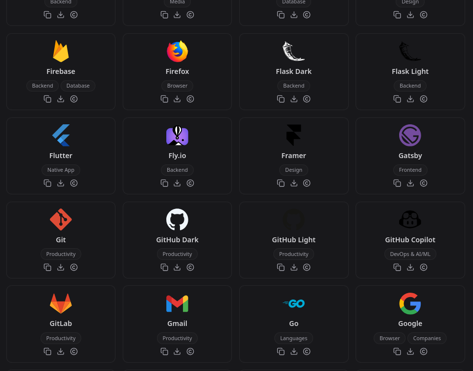

## The Icon Hunt Struggle

A few months ago, I was building my developer portfolio and wanted to showcase the technologies I work with. What seemed like a simple task turned into a time-consuming challenge:

- Finding transparent background icons
- Maintaining consistent sizes and styles
- Dealing with low-resolution images that looked pixelated
- Managing different color schemes for dark/light modes
- Hunting for specific tech stack logos

## Enter Developer Icons

That's when I discovered [Developer Icons](https://xandemon.github.io/developer-icons/), a game-changing library specifically designed for developers. It's like having a Swiss Army knife for tech stack icons!

### Key Features That Make It Special

#### 1. Optimization & Performance

All icons are highly optimized without compromising quality. This means:

- Minimal file sizes
- Fast loading times
- Clean, crisp rendering

#### 2. Complete Customization

You can easily customize:

- Icon sizes
- Colors
- Stroke width
- Other styling properties

#### 3. Perfect Scaling

No more pixelation issues! The icons are designed to scale perfectly at any size, making them ideal for:

- Responsive designs
- Different screen sizes
- Various use cases (from small icons to large hero images)

#### 4. Consistency Across Icons

One of the biggest advantages is the consistent design language across all icons. Every icon follows the same design principles, ensuring:

- Uniform style
- Balanced proportions
- Professional appearance

#### 5. Multiple Variants

The library offers different variants for each icon:

- Light mode versions
- Dark mode versions
- Wordmark options
- Additional style variations

## Thanks for Reading!

I hope this guide helps you find the perfect icons for your next development project. Developer Icons has become an essential part of my toolkit, and I believe it can enhance your development workflow too.
